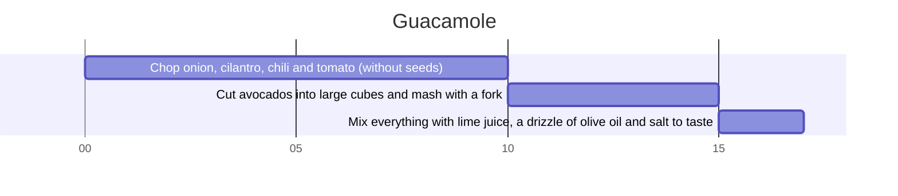

# Guacamole

Serves 2

## Ingredients

- Avocado: 2
- Lime: 1/2
- Red onion: 1/2
- Tomato: 1/2
- Cilantro: 1/2 bunch
- Red chili pepper: 1/2
- Salt
- Olive oil

## Instructions

```mermaid
gantt
    title Guacamole
    dateFormat m
    axisFormat %M
    tickInterval 5minute

    Chop onion, cilantro, chili and tomato (without seeds) : prep1, 0, 10
    Cut avocados into large cubes and mash with a fork : prep2, after prep1, 5m
    Mix everything with lime juice, a drizzle of olive oil and salt to taste : prep3, after prep2, 2m
``` 