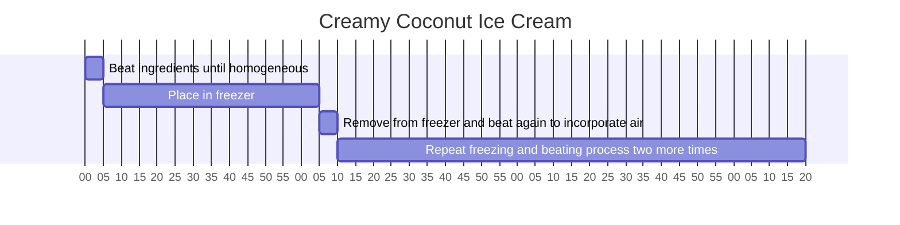

# Coconut Ice Cream

Serves 4

## Ingredients

- Condensed milk: 1 can
- Heavy cream: 1 can (300g)
- Coconut milk: 120g
- Shredded coconut: 100g

## Instructions

```mermaid
gantt
    title Creamy Coconut Ice Cream
    dateFormat m
    axisFormat %M
    tickInterval 5minute

    Beat ingredients until homogeneous: prep1, 0, 5m
    Place in freezer: prep2, after prep1, 60m
    Remove from freezer and beat again to incorporate air: prep3, after prep2, 5m
    Repeat freezing and beating process two more times: prep4, after prep3, 130m
``` 