# Sausage and Kale Risotto

Serves 4

## Ingredients

- Arborio rice: 1 cup
- Italian sausage: 1 cup (crumbled or chopped)
- Onion: 1/2 (chopped)
- Dry red wine: 1/2 cup
- Parmesan cheese: 1/2 cup (grated)
- Butter: 3 tablespoons
- Kale: 4 leaves
- Olive oil, salt and pepper to taste
- Vegetable or chicken stock: 4 cups (kept hot)

## Instructions

```mermaid
gantt
    title Sausage and Kale Risotto
    dateFormat  m
    axisFormat %M
    tickInterval 5minute

    section Mise en place
    Heat stock and keep it hot : misenplace1, 0, 44m
    Crumble the sausage : misenplace2, 0, 10m
    Dice onion and slice kale into strips : misenplace3, after misenplace2, 10m
    Grate parmesan : misenplace4, after misenplace3, 5m

    section Preparation
    Sauté sausage with part of onion and olive oil: prep1, after misenplace4, 10m
    Add kale to the pan off heat to deglaze the bottom : prep2, after prep1, 2m
    Sauté rice with remaining onion and olive oil until translucent : prep3, after prep2, 5m
    Add wine and stir until absorbed : prep4, after prep3, 2m
    Gradually add stock and let reduce until rice is al dente : prep5, after prep4, 15m
    Finish by mixing in butter, parmesan, kale and sausage : prep6, after prep5, 5m
``` 

