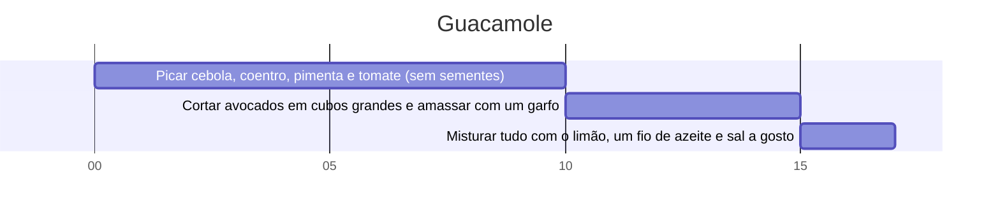

Serve 2

Ingredientes:

- Avocado: 2
- Limão: 1/2
- Cebola roxa: 1/2
- Tomate: 1/2
- Coentro: 1/2 maço
- Pimenta dedo-de-moça: 1/2
- Sal
- Azeite

```mermaid
gantt
    title Guacamole
    dateFormat m
    axisFormat %M
    tickInterval 5minute

    Picar cebola, coentro, pimenta e tomate (sem sementes) : prep1, 0, 10
    Cortar avocados em cubos grandes e amassar com um garfo : prep2, after prep1, 5m
    Misturar tudo com o limão, um fio de azeite e sal a gosto : prep3, after prep2, 2m
```