# Sorvete de baunilha

Serve 4

## Ingredientes

Ingredientes:

- Gemas de ovos: 4
- Açúcar refinado: 180g
- Leite integral: 500ml
- Creme de leite fresco: 250ml
- Sal: 2 pitadas
- Baunilha: 1 fava (ou 1-2 colheres de chá de essência de baunilha)

## Modo de preparo

```mermaid
gantt
    title Sorvete de baunilha
    dateFormat m
    axisFormat %M
    tickInterval 5minute

    section Base
    Separe as gemas dos ovos : prep1, 0, 5m
    Misture gemas, açúcar, leite, creme de leite, sal e baunilha : prep2, after prep1, 10m
    Cozinhe a mistura em fogo baixo (76°C ou até produzir bastante vapor), misturando constantemente : prep3, after prep2, 15m
    Esfrie em banho-maria invertido : prep4, after prep3, 20m

    section Processamento
    Bata a mistura resfriada : process1, after prep4, 10m
    Coloque no congelador : process2, after process1, 60m
    Retire do congelador e bata novamente: process3, after process2, 10m
    Coloque novamente no congelador e bata mais duas vezes: process4, after process3, 140m
```

