# Risotto de linguiça com couve

Serve 4

## Ingredientes

- Arroz arbório: 1 xícara
- Linguiça serrana: 1 xícara (debulhada ou picada)
- Cebola: 1/2 colher de sopa (picada)
- Vinho tinto seco: 1/2 xícara
- Parmesão: 1/2 xícara (ralado)
- Manteiga: 3 colheres de sopa
- Couve: 4 folhas
- Azeite, sal e pimenta a gosto
- Caldo de legumes ou galinha: 4 xícaras (mantido aquecido)

## Modo de preparo

```mermaid
gantt
    title Risotto de linguiça com couve
    dateFormat  m
    axisFormat %M
    tickInterval 5minute

    section Mise en place
    Aqueça o caldo e mantenha aquecido : misenplace1, 0, 25m
    Debulhe a linguiça : misenplace2, 0, 10m
    Pique a cebola em cubos e a couve em tiras : misenplace3, after misenplace2, 10m
    Rale o parmesão : misenplace4, after misenplace3, 5m

    section Preparo
    Refogue a linguiça com parte da cebola e azeite: prep1, after misenplace4, 10m
    Jogue a couve na panela fora do fogo para deglaciar o fundinho : prep2, after prep1, 2m
    Refogue o arroz com o resto da cebola e azeite até translúcido : prep3, after prep2, 5m
    Adicione vinho e mexa até absorver : prep4, after prep3, 2m
    Vá adicionando caldo gradualmente e deixando ele reduzir até o arroz ficar al dente : prep5, after prep4, 15m
    Finalize misturando a manteiga, parmesão, couve e linguiça : prep6, after prep5, 5m
```

